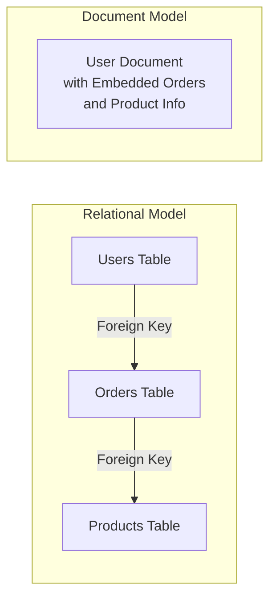
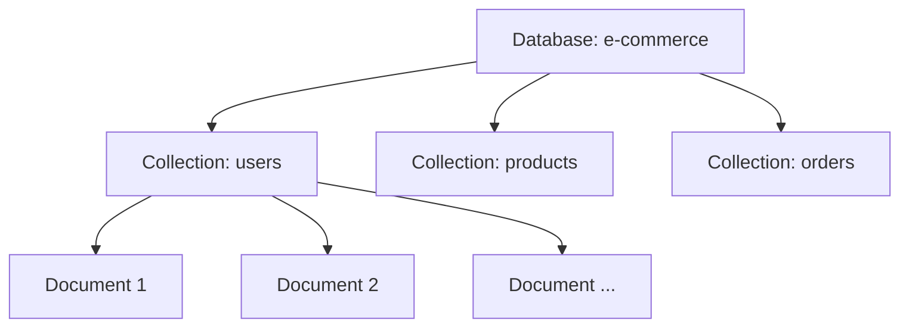
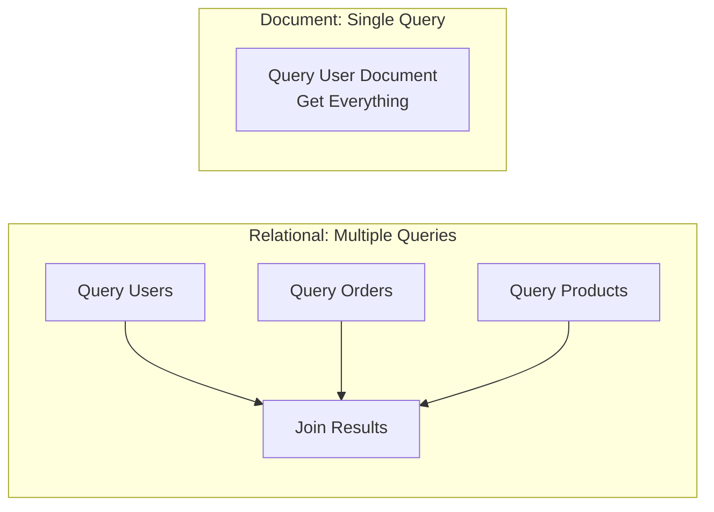
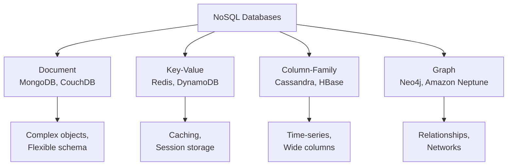
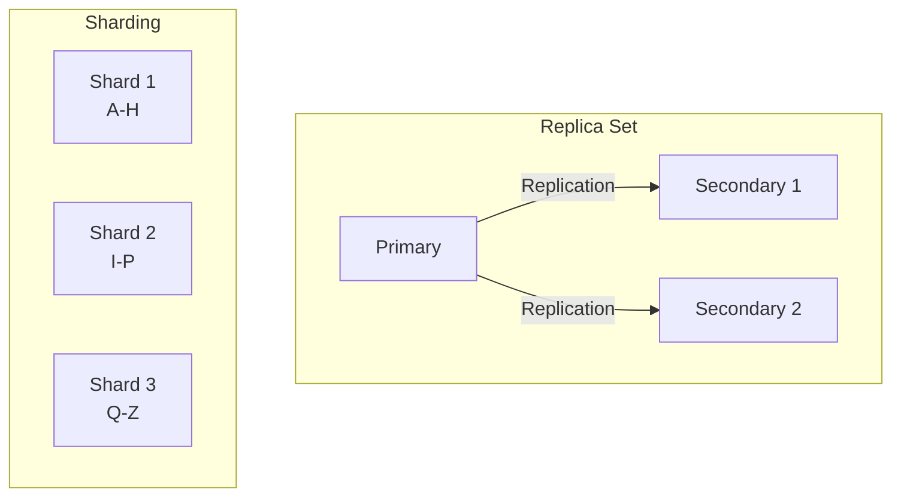

# 📚 Theory Primer: Document Databases

## What is a Document Database?

A document database stores data as documents, similar to JSON objects. Each document contains field-value pairs, where values can be strings, numbers, arrays, or even nested documents.

### Traditional Relational vs Document Model



## Key Concepts

### 1. Documents

A document is a self-contained unit of data:

```javascript
{
  "_id": ObjectId("507f1f77bcf86cd799439011"),
  "name": "John Doe",
  "email": "john@example.com",
  "age": 30,
  "address": {
    "street": "123 Main St",
    "city": "Boston",
    "country": "USA"
  },
  "orders": [
    {
      "orderId": "ORD001",
      "date": ISODate("2024-01-15"),
      "total": 99.99,
      "items": ["Product A", "Product B"]
    }
  ]
}
```

### 2. Collections

Documents are organized into collections (similar to tables in relational databases):



### 3. Schema Flexibility

Unlike relational databases, document databases are schema-flexible:

**Same collection, different document structures:**

```javascript
// Document 1: Basic user
{
  "_id": 1,
  "name": "Alice",
  "email": "alice@example.com"
}

// Document 2: User with preferences
{
  "_id": 2,
  "name": "Bob",
  "email": "bob@example.com",
  "preferences": {
    "newsletter": true,
    "notifications": "daily"
  },
  "social": {
    "twitter": "@bob"
  }
}
```

## Advantages of Document Databases

### 1. Natural Data Representation

- Data stored as it's used in applications
- No need for complex joins
- Intuitive for developers

### 2. Performance Benefits



### 3. Horizontal Scalability

- Easy to shard across multiple servers
- Each document is self-contained
- No foreign key constraints to maintain

### 4. Flexible Evolution

- Add new fields without migrations
- Different documents can have different fields
- Backward compatibility built-in

## When to Use Document Databases

### ✅ Good Use Cases

1. **Content Management Systems**
   - Blog posts with comments
   - Product catalogs
   - User profiles

2. **Real-time Analytics**
   - Event logging
   - Sensor data
   - User activity tracking

3. **Mobile Applications**
   - Offline-first apps
   - User preferences
   - Game state

4. **Catalogs and Inventories**
   - Product information
   - Asset management
   - Configuration data

### ❌ Less Suitable Use Cases

1. **Complex Transactions**
   - Multi-entity ACID requirements
   - Banking systems with strict consistency

2. **Heavy Relationships**
   - Social network graphs
   - Recommendation engines
   - Bill of materials

3. **Reporting**
   - Complex SQL-style reporting
   - Data warehousing
   - Business intelligence

## ACID Properties in Document Databases

Modern document databases like MongoDB support ACID:

- **Atomicity**: Single document operations are atomic
- **Consistency**: Schema validation ensures consistency
- **Isolation**: Read/write concerns provide isolation levels
- **Durability**: Write concerns ensure durability

```javascript
// MongoDB Transaction Example
const session = client.startSession();
session.startTransaction();
try {
  await orders.insertOne(orderDoc, { session });
  await inventory.updateOne({ sku: "ABC123" }, { $inc: { quantity: -1 } }, { session });
  await session.commitTransaction();
} catch (error) {
  await session.abortTransaction();
}
```

## Document Database vs Other NoSQL Types



## Best Practices

### 1. Design for Your Access Patterns

- Embed data that's accessed together
- Reference data that's accessed separately
- Consider read vs write frequency

### 2. Document Size Considerations

- MongoDB document size limit: 16MB
- Keep frequently updated data separate
- Use GridFS for large files

### 3. Indexing Strategy

- Index fields used in queries
- Compound indexes for multi-field queries
- Avoid over-indexing (write performance impact)

### 4. Data Consistency

- Use appropriate read/write concerns
- Implement application-level validation
- Consider using transactions when needed

## MongoDB Specific Features

### 1. Query Language

```javascript
// Find documents
db.users.find({ age: { $gte: 18 } });

// Aggregation pipeline
db.orders.aggregate([
  { $match: { status: "completed" } },
  {
    $group: {
      _id: "$customerId",
      totalSpent: { $sum: "$total" },
    },
  },
]);
```

### 2. Indexing Types

- Single field indexes
- Compound indexes
- Multikey indexes (arrays)
- Text indexes
- Geospatial indexes
- Hashed indexes

### 3. Replication & Sharding



## Summary

Document databases offer:

- **Flexibility**: Schema-less design adapts to changing requirements
- **Performance**: Denormalized data reduces joins
- **Scalability**: Horizontal scaling through sharding
- **Developer-friendly**: JSON-like documents match application objects

Understanding these concepts prepares you for effective MongoDB development and helps you make informed decisions about when and how to use document databases in your applications.

---

**Next Steps:**

- [Lab 01: Introduction to MongoDB](../../labs/lab01_intro/README.md)
- [Theory Primer: Data Modeling Tradeoffs](02_data_modeling_tradeoffs.md)

_Last Updated: December 2024_
