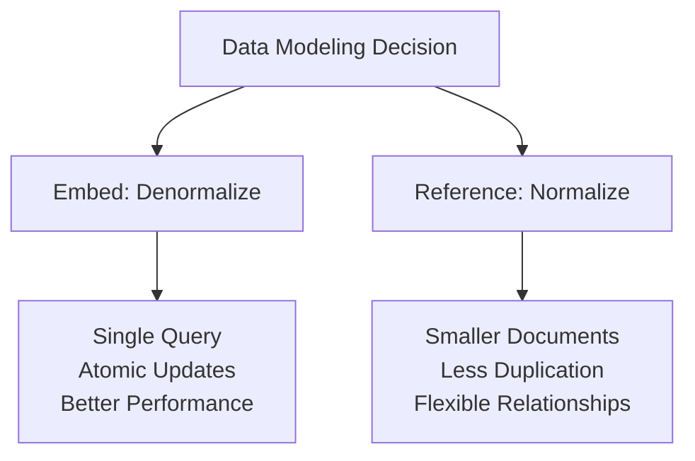
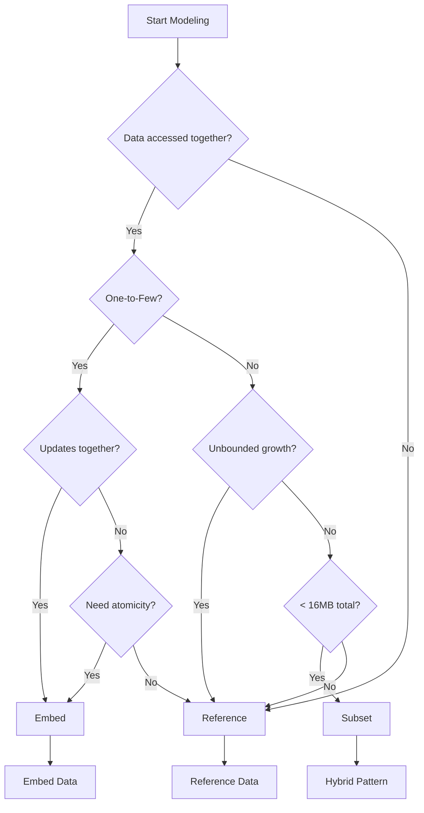

# 🏗️ Theory Primer: Data Modeling Tradeoffs

## The Core Decision: Embed vs Reference

In MongoDB, the fundamental modeling decision is whether to embed related data within a document or reference it in separate documents.



## Embedding Pattern

### When to Embed

Embed when you have:

- **One-to-One relationships**
- **One-to-Few relationships** (< 100 subdocuments)
- **Data accessed together**
- **Data updated together**

### Example: Blog Post with Comments

```javascript
// EMBEDDED DESIGN - Good for blogs with moderate comments
{
  "_id": ObjectId("..."),
  "title": "Understanding MongoDB",
  "author": "Jane Doe",
  "content": "MongoDB is a document database...",
  "tags": ["database", "nosql", "mongodb"],
  "comments": [
    {
      "commentId": ObjectId("..."),
      "user": "John Smith",
      "text": "Great article!",
      "date": ISODate("2024-01-15"),
      "likes": 5
    },
    {
      "commentId": ObjectId("..."),
      "user": "Alice Brown",
      "text": "Very helpful, thanks!",
      "date": ISODate("2024-01-16"),
      "likes": 3
    }
  ],
  "stats": {
    "views": 1520,
    "likes": 45,
    "shares": 12
  }
}
```

### Benefits of Embedding

✅ **Atomicity**: Update entire document atomically
✅ **Performance**: Single query retrieves all data
✅ **Locality**: Related data stored together on disk
✅ **Simplicity**: No joins required

### Drawbacks of Embedding

❌ **Document Size**: 16MB limit in MongoDB
❌ **Duplication**: Same data repeated across documents
❌ **Working Set**: Large documents increase memory usage
❌ **Write Amplification**: Updating subdocument rewrites entire document

## Referencing Pattern

### When to Reference

Reference when you have:

- **One-to-Many relationships** (unbounded)
- **Many-to-Many relationships**
- **Frequently accessed independently**
- **Large subdocuments**

### Example: E-commerce with Orders

```javascript
// USERS COLLECTION
{
  "_id": ObjectId("user123"),
  "name": "Jane Doe",
  "email": "jane@example.com",
  "address": {
    "street": "123 Main St",
    "city": "Boston",
    "zip": "02101"
  }
}

// ORDERS COLLECTION - References user
{
  "_id": ObjectId("order456"),
  "userId": ObjectId("user123"),  // Reference to user
  "orderDate": ISODate("2024-01-15"),
  "status": "shipped",
  "items": [
    { "productId": ObjectId("prod789"), "quantity": 2, "price": 29.99 }
  ],
  "total": 59.98
}

// PRODUCTS COLLECTION
{
  "_id": ObjectId("prod789"),
  "name": "MongoDB Book",
  "category": "Books",
  "price": 29.99,
  "inventory": 150
}
```

### Benefits of Referencing

✅ **Flexibility**: Update referenced data once
✅ **Smaller Documents**: Each document stays focused
✅ **Unbounded Growth**: No limit on relationships
✅ **Independent Access**: Query each collection separately

### Drawbacks of Referencing

❌ **Multiple Queries**: Need joins ($lookup) to get full data
❌ **No Atomicity**: Updates across documents not atomic (without transactions)
❌ **Complexity**: Application must handle relationships
❌ **Performance**: Additional round trips to database

## Hybrid Patterns

### Pattern 1: Subset Pattern

Store frequently accessed subset embedded, full data referenced:

```javascript
// USER DOCUMENT - With recent orders subset
{
  "_id": ObjectId("user123"),
  "name": "Jane Doe",
  "email": "jane@example.com",
  "recentOrders": [  // Last 5 orders only
    {
      "orderId": ObjectId("order456"),
      "date": ISODate("2024-01-15"),
      "total": 59.98,
      "status": "shipped"
    },
    // ... 4 more recent orders
  ]
}

// ORDERS COLLECTION - Complete order history
{
  "_id": ObjectId("order456"),
  "userId": ObjectId("user123"),
  "orderDate": ISODate("2024-01-15"),
  "items": [...],  // Full details
  "shipping": {...},
  "payment": {...}
}
```

### Pattern 2: Extended Reference Pattern

Store frequently needed fields with reference:

```javascript
// ORDER DOCUMENT - With user summary
{
  "_id": ObjectId("order456"),
  "user": {
    "userId": ObjectId("user123"),  // Reference
    "name": "Jane Doe",              // Cached for display
    "email": "jane@example.com"      // Cached for notifications
  },
  "items": [
    {
      "productId": ObjectId("prod789"),  // Reference
      "name": "MongoDB Book",             // Cached for display
      "price": 29.99,                     // Cached at order time
      "quantity": 2
    }
  ],
  "total": 59.98
}
```

### Pattern 3: Bucket Pattern

Group related time-series data into buckets:

```javascript
// SENSOR READINGS - Bucketed by hour
{
  "_id": ObjectId("..."),
  "sensorId": "sensor_001",
  "startTime": ISODate("2024-01-15T10:00:00"),
  "endTime": ISODate("2024-01-15T11:00:00"),
  "measurements": [
    { "timestamp": ISODate("2024-01-15T10:00:00"), "temp": 22.5, "humidity": 45 },
    { "timestamp": ISODate("2024-01-15T10:01:00"), "temp": 22.6, "humidity": 44 },
    // ... 58 more measurements
  ],
  "stats": {
    "avgTemp": 22.7,
    "maxTemp": 23.1,
    "minTemp": 22.3,
    "count": 60
  }
}
```

## Decision Framework



## Real-World Examples

### Social Media Platform

```javascript
// USER PROFILE - Mixed approach
{
  "_id": ObjectId("..."),
  "username": "johndoe",
  "profile": {  // Embedded - Always needed
    "name": "John Doe",
    "bio": "Software Developer",
    "avatar": "https://...",
    "verified": true
  },
  "stats": {  // Embedded - Frequently displayed
    "followers": 1520,
    "following": 320,
    "posts": 89
  },
  "recentPosts": [  // Subset - Last 10 posts
    { "postId": ObjectId("..."), "preview": "...", "likes": 45 }
  ],
  "settings": {  // Embedded - User-specific
    "privacy": "public",
    "notifications": true
  }
}

// POSTS COLLECTION - Referenced
{
  "_id": ObjectId("..."),
  "userId": ObjectId("..."),
  "content": "Full post content...",
  "media": [...],
  "comments": ObjectId("..."),  // Reference to comments collection
  "likes": [...],  // Array of user IDs who liked
  "created": ISODate("...")
}
```

### E-Learning Platform

```javascript
// COURSE DOCUMENT - Strategic embedding
{
  "_id": ObjectId("..."),
  "title": "MongoDB Mastery",
  "instructor": {  // Extended reference
    "instructorId": ObjectId("..."),
    "name": "Dr. Smith",
    "avatar": "..."
  },
  "modules": [  // Embedded - Course structure
    {
      "moduleId": 1,
      "title": "Introduction",
      "lessons": [  // Embedded - Always accessed with course
        { "lessonId": 1, "title": "What is MongoDB?", "duration": 600 }
      ]
    }
  ],
  "enrollments": 1520,  // Counter - Not array of students!
  "rating": {
    "average": 4.8,
    "count": 245
  }
}

// ENROLLMENT COLLECTION - Separate for student progress
{
  "_id": ObjectId("..."),
  "studentId": ObjectId("..."),
  "courseId": ObjectId("..."),
  "progress": {
    "completed": [1, 2, 3],  // Lesson IDs
    "currentLesson": 4,
    "percentComplete": 25
  }
}
```

## Performance Implications

### Read Performance

| Pattern    | Single Doc Read | Related Data Read   | Query Complexity  |
| ---------- | --------------- | ------------------- | ----------------- |
| Embedded   | ⚡ Fastest      | ⚡ Fastest          | Simple            |
| Referenced | ⚡ Fastest      | 🐌 Multiple queries | Complex ($lookup) |
| Hybrid     | ⚡ Fast         | ⚡ Fast for subset  | Moderate          |

### Write Performance

| Pattern    | Update Speed | Write Amplification  | Concurrency |
| ---------- | ------------ | -------------------- | ----------- |
| Embedded   | 🐌 Slower    | High (rewrites doc)  | Lower       |
| Referenced | ⚡ Faster    | Low (update one doc) | Higher      |
| Hybrid     | ⚡ Fast      | Moderate             | Moderate    |

## Anti-Patterns to Avoid

### ❌ Unbounded Arrays

```javascript
// BAD: Comments array grows forever
{
  "postId": 1,
  "comments": [
    // Could grow to thousands...
  ]
}

// GOOD: Reference pattern for unbounded
{
  "postId": 1,
  "commentCount": 5234
}
// Separate comments collection
```

### ❌ Massive Embedded Documents

```javascript
// BAD: Embedding entire product catalog
{
  "userId": 1,
  "purchaseHistory": [
    // Hundreds of complete product documents
  ]
}

// GOOD: Reference with summary
{
  "userId": 1,
  "recentPurchases": [
    { "productId": 123, "name": "...", "date": "..." }
  ]
}
```

### ❌ Too Much Referencing

```javascript
// BAD: Over-normalized like relational
{
  "userId": 1,
  "addressId": ObjectId("..."),  // Separate collection for one address!
  "preferencesId": ObjectId("...")  // Another collection for preferences!
}

// GOOD: Embed 1:1 relationships
{
  "userId": 1,
  "address": { ... },
  "preferences": { ... }
}
```

## Best Practices Summary

1. **Design for your queries** - Model based on access patterns
2. **Avoid unbounded growth** - Use references for large arrays
3. **Consider document size** - Stay well under 16MB limit
4. **Optimize for common case** - 80/20 rule applies
5. **Denormalize thoughtfully** - Balance duplication vs. performance
6. **Use transactions sparingly** - Design to avoid them when possible
7. **Monitor and iterate** - Measure performance and adjust

## Migration Strategies

When you need to change your model:

1. **Lazy Migration**: Update documents as accessed
2. **Batch Migration**: Background job updates all documents
3. **Dual Write**: Write to both old and new structure temporarily
4. **Versioning**: Add schema version field to documents

---

**Next Steps:**

- [Lab 02: Data Modeling](../../labs/lab02_modeling/README.md)
- [Theory Primer: Indexing Strategies](03_indexing_strategies.md)

_Last Updated: December 2024_
