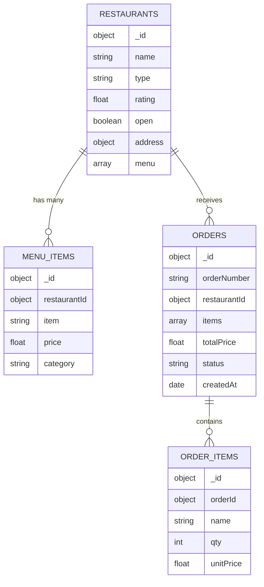

# Group 22 – MongoDB NoSQL Database Project

## Team Members
See our team composition in [group_members.md](../group_members.md#group-22).

---

# Project Overview
For this project, we were required to design and implement a MongoDB database based on a dataset of our choice.  
We created a complete NoSQL system for a **restaurant ordering platform**, including restaurants, menu items, orders, and order items.

### Learning Objectives Achieved
- Designed a real-world MongoDB schema
- Implemented CRUD operations across multiple collections
- Used aggregation pipelines to compute statistics
- Applied query operators for filtering and sorting

---

# Database Design

## ER Diagram (Mermaid)



---

# Collections Created

Below are **expanded examples** representing realistic documents in each collection.

---

## 1. **restaurants**
Stores information about a restaurant, including address and an embedded menu.

```json
{
  "_id": { "$oid": "51fe29d3685d4a0a9f055a87" },
  "name": "Pizza Pino Nice",
  "type": "Libanais",
  "rating": 3.6,
  "open": false,
  "address": {
    "street": "61 rue de Bordeaux",
    "city": "Bordeaux",
    "postalCode": "88455"
  },
  "menu": [
    { "item": "Tiramisu", "price": 15.92, "category": "dessert" },
    { "item": "Lasagnes", "price": 11.99, "category": "main" }
  ]
}
```

---

## 2. **menu_items**
Contains individual menu items referencing their restaurant.

```json
{
  "_id": { "$oid": "6972ad45985ef13385ba429b" },
  "restaurantId": { "$oid": "51fe29d3685d4a0a9f055a87" },
  "item": "Tiramisu",
  "price": 15.92,
  "category": "dessert"
}
```


---

## 3. **orders**
Represents an entire customer order using **embedded items**.

```json
{
  "_id": { "$oid": "690367d6b52abfb7d152f781" },
  "orderNumber": "ORD-1000",
  "restaurantId": { "$oid": "7a42b136e2ea484f9396503a" },
  "items": [
    { "name": "Tacos au Boeuf", "qty": 1, "unitPrice": 11.76 },
    { "name": "Smoothie Vert", "qty": 3, "unitPrice": 11.76 }
  ],
  "totalPrice": 85.6,
  "status": "delivered",
  "createdAt": { "$date": "2025-10-23T10:47:17.250Z" }
}
```


---

## 4. **order_items**
Referenced “line item” version of order contents.

```json
{
  "_id": { "$oid": "6972ad45985ef13385ba42ff" },
  "orderId": { "$oid": "690367d6b52abfb7d152f781" },
  "name": "Tacos au Boeuf",
  "qty": 1,
  "unitPrice": 11.76
}
```


---

# Schema Design Decisions
- **Embedded items** in `orders` → fast order retrieval  
- **Referenced menu items** → reusable and easy to query  
- **Embedded menu inside restaurants** → faster display of restaurant pages  
- Mixed approach supports both transactional and analytical queries  

---

# Data Operations Implemented

## 1. Database Setup
- Created `group_22` database

## 2. Insert Operations
- Run seed.js to populate the database

## 3. Query Operations (Examples)

### **Open restaurants in city**
```javascript
db.restaurants
  .find(
    { "address.city": "Toulouse", open: true },
    { _id: 0, name: 1, type: 1, rating: 1 }
  )
  .sort({ rating: -1 })
  .forEach((doc) => printjson(doc));
```

### **Find Restaurants by Cuisine and Sorted by Rating**
```javascript
db = db.getSiblingDB("group_22");
print("Indien restaurants sorted by rating (highest first):");
db.restaurants
  .find({ type: "Indien" }, { _id: 0, name: 1, rating: 1, address: 1 })
  .sort({ rating: -1 })
  .forEach((doc) => printjson(doc));
```


---

# Aggregation Pipelines (Example)

### **Average Price per Category for Restaurant**
```javascript
db.menu_items
.aggregate([
  { $match: { restaurantId: ObjectId("51fe29d3685d4a0a9f055a87") } },
  {
    $group: {
      _id: { restaurantId: "$restaurantId", category: "$category" },
      averagePrice: { $avg: "$price" }
    }
  },
  {
    $lookup: {
      from: "restaurants",
      localField: "_id.restaurantId",
      foreignField: "_id",
      as: "restaurant"
    }
  },
  { $unwind: "$restaurant" },
  {
    $project: {
      _id: 0,
      restaurantName: "$restaurant.name",
      category: "$_id.category",
      averagePrice: 1
    }
  },
  { $sort: { averagePrice: -1 } }
])
  .forEach((doc) => printjson(doc));
```


---


# Learning Outcomes
- Designing practical NoSQL structures  
- Embedding vs referencing trade-offs  
- Complex filtering and aggregation  
- Using MongoDB for real-world data  

---

# Future Enhancements
- Add user accounts and authentication  
- Add restaurant search by price range, rating, cuisine  
- Add analytics dashboard (top-selling items, busiest restaurants)  
- Add schema validation rules for stricter data consistency  

---

# Documentation
- `solution.md` – Full explanation of operations  
- `queries` – All queries and aggregations used  
- `data` – Sample data used for inserts  
- `seed.js` – File for populating the database

---

# Contributors
Group 22 – 2025/26
