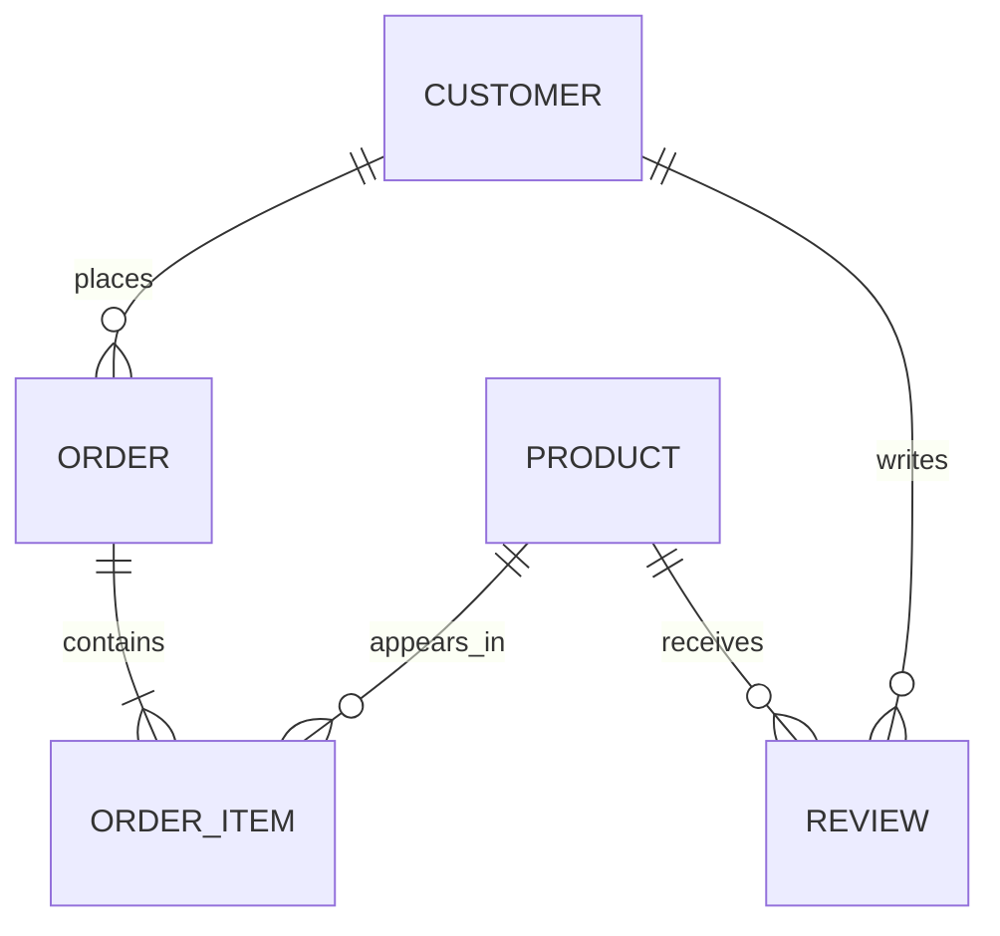

# Lab 02 - Data Modeling for E-Commerce Application

## 1\. Conceptual Model

### 1.1\. Entities and Attributes

#### **Customers**

- `customer_id` (unique identifier)
- `name` (full name)
- `email` (unique, for login)
- `password_hash` (hashed password)
- `address` (shipping address)
- `phone`
- `created_at` (registration date)
- `loyalty_points` (for rewards program)

#### **Products**

- `product_id` (unique identifier)
- `name`
- `description`
- `category` (e.g., "Electronics", "Clothing")
- `price`
- `stock_quantity`
- `images` (array of image URLs)
- `specifications` (varies by product type)
- `ratings` (average rating and count)
- `created_at`
- `updated_at`

#### **Orders**

- `order_id` (unique identifier)
- `customer_id` (reference to customer)
- `order_date`
- `status` (e.g., "pending", "processing", "shipped", "delivered")
- `shipping_address`
- `billing_address`
- `payment_method`
- `subtotal`
- `tax`
- `shipping_cost`
- `total`
- `items` (order line items)

#### **Order Items** (embedded in Orders)

- `product_id` (reference to product)
- `product_name` (denormalized for historical record)
- `quantity`
- `unit_price` (price at time of order)
- `subtotal`

#### **Reviews**

- `review_id` (unique identifier)
- `product_id` (reference to product)
- `customer_id` (reference to customer)
- `rating` (1-5 stars)
- `title`
- `comment`
- `helpful_count` (how many found it helpful)
- `created_at`

### 1.2\. Relationships

1. **Customer → Orders**: One-to-Many (one customer can have many orders)
2. **Order → Order Items**: One-to-Many (one order contains many items)
3. **Product → Order Items**: One-to-Many (one product can appear in many orders)
4. **Product → Reviews**: One-to-Many (one product can have many reviews)
5. **Customer → Reviews**: One-to-Many (one customer can write many reviews)

### 1.3\. Conceptual Diagram



--------------------------------------------------------------------------------

## 2\. NoSQL Logical Model (MongoDB)

### 2.1\. Collection: `customers`

**Strategy**: Single collection with embedded address information.

**Reasoning**:

- Customer data is frequently accessed together
- Address is not shared with other entities
- Simple schema, good for authentication and profile queries

**Example Document**:

```json
{
  "_id": ObjectId("..."),
  "customer_id": "CUST001",
  "name": "Alice Johnson",
  "email": "alice@example.com",
  "password_hash": "$2b$10$...",
  "phone": "+1-555-0123",
  "address": {
    "street": "123 Main St",
    "city": "New York",
    "state": "NY",
    "zip": "10001",
    "country": "USA"
  },
  "loyalty_points": 1250,
  "created_at": ISODate("2023-01-15T10:30:00Z")
}
```

**Required Fields**: `customer_id`, `name`, `email`, `password_hash`

**Indexes**:

- Unique index on `email` (for login)
- Index on `customer_id` (for lookups)

--------------------------------------------------------------------------------

### 2.2\. Collection: `products`

**Strategy**: Single collection with embedded specifications and rating summary.

**Reasoning**:

- Products are often queried independently
- Specifications vary by product type (flexible schema)
- Rating summary is denormalized for performance (computed from reviews)
- Images array is embedded (small, always needed with product)

**Example Document**:

```json
{
  "_id": ObjectId("..."),
  "product_id": "PROD001",
  "name": "Wireless Headphones XYZ",
  "description": "Premium noise-cancelling headphones...",
  "category": "Electronics",
  "subcategory": "Audio",
  "price": 199.99,
  "stock_quantity": 50,
  "images": [
    "https://cdn.example.com/prod001_1.jpg",
    "https://cdn.example.com/prod001_2.jpg"
  ],
  "specifications": {
    "brand": "AudioTech",
    "color": "Black",
    "wireless": true,
    "battery_life": "30 hours",
    "noise_cancellation": true
  },
  "ratings": {
    "average": 4.5,
    "count": 128
  },
  "created_at": ISODate("2023-06-01T00:00:00Z"),
  "updated_at": ISODate("2024-01-10T15:30:00Z")
}
```

**Required Fields**: `product_id`, `name`, `price`, `category`, `stock_quantity`

**Indexes**:

- Index on `product_id`
- Index on `category` (for browsing)
- Index on `price` (for filtering/sorting)
- Compound index on `category, price` (for category + price filter)
- Text index on `name, description` (for search)

--------------------------------------------------------------------------------

### 2.3\. Collection: `orders`

**Strategy**: Embed order items within orders, denormalize product information.

**Reasoning**:

- **Why embed order items**:

  - Order items are never queried independently
  - They always belong to exactly one order
  - Embedding allows atomic updates and retrieval in one query

- **Why denormalize product info** (name, price):

  - Products may change over time (price, name)
  - Order should reflect historical data at time of purchase
  - Prevents orphaned references if products are deleted

- **Why reference customer**:

  - Customer data may update (address, phone)
  - Reference keeps order size smaller
  - Customer may have many orders (referencing avoids duplication)

**Example Document**:

```json
{
  "_id": ObjectId("..."),
  "order_id": "ORD001",
  "customer_id": "CUST001",
  "order_date": ISODate("2024-01-15T14:30:00Z"),
  "status": "shipped",
  "shipping_address": {
    "street": "123 Main St",
    "city": "New York",
    "state": "NY",
    "zip": "10001",
    "country": "USA"
  },
  "billing_address": {
    "street": "123 Main St",
    "city": "New York",
    "state": "NY",
    "zip": "10001",
    "country": "USA"
  },
  "payment_method": "credit_card",
  "items": [
    {
      "product_id": "PROD001",
      "product_name": "Wireless Headphones XYZ",
      "quantity": 1,
      "unit_price": 199.99,
      "subtotal": 199.99
    },
    {
      "product_id": "PROD042",
      "product_name": "Phone Case",
      "quantity": 2,
      "unit_price": 15.99,
      "subtotal": 31.98
    }
  ],
  "subtotal": 231.97,
  "tax": 20.88,
  "shipping_cost": 9.99,
  "total": 262.84,
  "tracking_number": "1Z999AA10123456784",
  "estimated_delivery": ISODate("2024-01-20T00:00:00Z")
}
```

**Required Fields**: `order_id`, `customer_id`, `order_date`, `status`, `items`, `total`

**Indexes**:

- Index on `order_id`
- Index on `customer_id` (for "my orders" queries)
- Index on `order_date` (for date range queries)
- Compound index on `customer_id, order_date` (for customer order history)
- Index on `status` (for admin queries on pending/processing orders)

--------------------------------------------------------------------------------

### 2.4\. Collection: `reviews`

**Strategy**: Separate collection with references to products and customers, denormalize key info.

**Reasoning**:

- **Why separate collection**:

  - Reviews can be numerous (thousands per popular product)
  - Embedding in products would create large documents
  - Allows querying reviews independently (e.g., "all reviews by user")

- **Why denormalize product_name and customer_name**:

  - Avoids extra lookups when displaying reviews
  - Names rarely change, and if they do, historical reviews are fine

- **Why reference IDs**:

  - Allows linking back to products and customers if needed
  - Keeps review documents reasonably sized

**Example Document**:

```json
{
  "_id": ObjectId("..."),
  "review_id": "REV001",
  "product_id": "PROD001",
  "product_name": "Wireless Headphones XYZ",
  "customer_id": "CUST001",
  "customer_name": "Alice J.",
  "rating": 5,
  "title": "Excellent sound quality!",
  "comment": "These headphones exceeded my expectations. The noise cancellation is superb and battery life is as advertised.",
  "helpful_count": 42,
  "verified_purchase": true,
  "created_at": ISODate("2024-01-20T10:15:00Z")
}
```

**Required Fields**: `review_id`, `product_id`, `customer_id`, `rating`

**Indexes**:

- Index on `product_id` (for "reviews for this product")
- Index on `customer_id` (for "reviews by this user")
- Compound index on `product_id, created_at` (for recent reviews)
- Index on `rating` (for filtering)

--------------------------------------------------------------------------------

## 3\. Embedding vs Referencing Decisions

### 3.1\. Summary Table

Relationship                    | Strategy                            | Reasoning
------------------------------- | ----------------------------------- | --------------------------------------------------------
Customer → Address              | **Embed**                           | Address is always needed with customer, not shared
Order → Order Items             | **Embed**                           | Items never queried separately, belong to one order only
Order → Customer                | **Reference**                       | Customer data may update, customer has many orders
Order → Product Info            | **Denormalize**                     | Preserve historical prices/names at time of purchase
Product → Reviews               | **Reference** (separate collection) | Too many reviews, would create huge documents
Review → Product/Customer Names | **Denormalize**                     | Avoid extra lookups, names rarely change

### 3.2\. Detailed Justification

#### **When to Embed**:

1. **One-to-Few** relationships (e.g., customer → address)
2. Data is **always accessed together**
3. Child data **doesn't need to be queried independently**
4. Child data **belongs to only one parent**

#### **When to Reference**:

1. **One-to-Many** or **Many-to-Many** with many items
2. Child data needs to be **queried independently**
3. Data is **shared across entities**
4. Document size would exceed **16MB limit**

#### **When to Denormalize**:

1. Need to **preserve historical data** (e.g., order prices)
2. Referenced data **rarely changes**
3. Want to **avoid extra queries** for frequently accessed data
4. Accept **eventual consistency** for read performance

--------------------------------------------------------------------------------

## 4\. Trade-offs and Considerations

### 4.1\. Advantages of This Model

1. **Fast order retrieval**: Single query gets complete order with all items
2. **Historical accuracy**: Orders preserve product prices at purchase time
3. **Scalable reviews**: Separate collection prevents product documents from growing too large
4. **Efficient customer queries**: Customer data is compact and fast to retrieve
5. **Good for analytics**: Can aggregate orders by date, customer, product without complex joins

### 4.2\. Disadvantages and Mitigations

Issue                                                  | Mitigation
------------------------------------------------------ | ------------------------------------------------------------------------
**Denormalized data may become stale**                 | For reviews, names changing is rare. If needed, run batch update
**Product rating summary needs updates**               | Use background job or trigger to recompute after new reviews
**Order items don't link back to products**            | Keep `product_id` reference for analytics, just denormalize display data
**Cannot easily update all orders if product deleted** | Keep `product_id`, use it to mark items as "product no longer available"

### 4.3\. Alternative Designs

#### **Alternative 1: Fully Normalized (Relational-Style)**

- Separate collections for orders and order_items
- **Downside**: Requires $lookup (join) for every order display
- **Use case**: If order items need to be queried independently

#### **Alternative 2: Embed Everything**

- Embed reviews into products, orders into customers
- **Downside**: Documents grow unbounded, may hit 16MB limit
- **Use case**: Only for very small-scale applications

--------------------------------------------------------------------------------

## 5\. Indexes and Performance

### 5.1\. Proposed Indexes

```javascript
// Customers collection
db.customers.createIndex({ customer_id: 1 }, { unique: true });
db.customers.createIndex({ email: 1 }, { unique: true });

// Products collection
db.products.createIndex({ product_id: 1 }, { unique: true });
db.products.createIndex({ category: 1 });
db.products.createIndex({ price: 1 });
db.products.createIndex({ category: 1, price: 1 });
db.products.createIndex({ name: "text", description: "text" });

// Orders collection
db.orders.createIndex({ order_id: 1 }, { unique: true });
db.orders.createIndex({ customer_id: 1 });
db.orders.createIndex({ order_date: -1 });
db.orders.createIndex({ customer_id: 1, order_date: -1 });
db.orders.createIndex({ status: 1 });
db.orders.createIndex({ "items.product_id": 1 });  // For analytics

// Reviews collection
db.reviews.createIndex({ review_id: 1 }, { unique: true });
db.reviews.createIndex({ product_id: 1 });
db.reviews.createIndex({ customer_id: 1 });
db.reviews.createIndex({ product_id: 1, created_at: -1 });
db.reviews.createIndex({ rating: 1 });
```

### 5.2\. Trade-offs

**Benefits**:

- Faster queries on indexed fields
- Efficient sorting and filtering
- Unique constraints on IDs and emails

**Costs**:

- **Storage**: Each index uses disk space (~10-20% of collection size per index)
- **Write Performance**: Every insert/update must update all relevant indexes
- **Memory**: Indexes are loaded into RAM for fast access

**Recommendation**: Start with essential indexes (IDs, foreign keys), add others based on query patterns.

--------------------------------------------------------------------------------

## 6\. Scalability Considerations

### 6.1\. Sharding Strategy

As the application grows, we may need to shard collections:

- **Customers**: Shard by `customer_id` (even distribution)
- **Products**: Shard by `product_id` or `category` (if categories are balanced)
- **Orders**: Shard by `customer_id` (keeps customer's orders on same shard)
- **Reviews**: Shard by `product_id` (keeps product reviews together)

### 6.2\. Read/Write Patterns

- **Read-heavy**: Products, Reviews (cache frequently accessed items)
- **Write-heavy**: Orders (use replica sets for read scaling)
- **Balanced**: Customers (moderate reads and writes)

--------------------------------------------------------------------------------

## 7\. Conclusion

This data model balances:

- **Performance**: Embedding order items, denormalizing for reads
- **Scalability**: Separate reviews collection, shard-friendly design
- **Data Integrity**: References where needed, unique indexes
- **Flexibility**: Flexible schemas for product specifications
- **Query Efficiency**: Indexes on common query patterns

The model is optimized for the typical e-commerce workload: browsing products, placing orders, and reading reviews.
