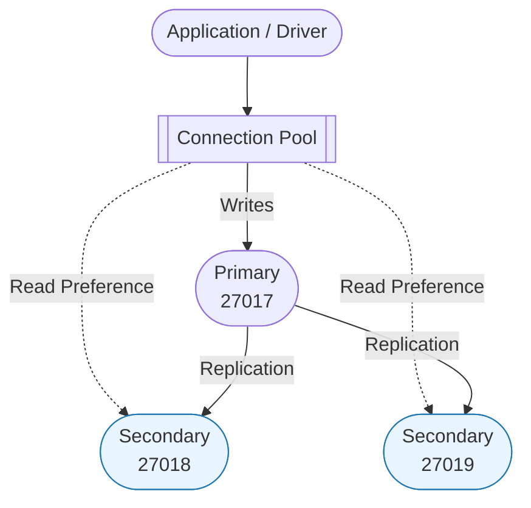

# Lab 05 - Replication and High Availability Notes

## Student Information

- **Lab**: Lab 05 - Replication and High Availability
- **Database**: MongoDB Replica Set
- **Focus**: High availability, failover, read/write distribution
- **MongoDB Version**: 6.0+ recommended

---

## 1. Overview

This lab provides hands-on experience with MongoDB replica sets, demonstrating:

- **Automatic failover** and high availability
- **Read preference strategies** for scaling reads
- **Write concern levels** for durability guarantees
- **Replication lag** and consistency considerations
- **Oplog management** and recovery procedures
- **Production deployment** best practices

---

## 2. Files in This Lab

```
labs/lab05_replication/
├── README.md                 # Lab instructions
├── NOTES.md                  # This file (comprehensive reference)
├── setup_replica_set.js      # Automated replica set setup
├── simulate_failover.js      # Failover simulation and testing
├── read_preferences.js       # Read preference demonstrations
├── write_concerns.js         # Write concern examples
├── test_replication.js       # Test suite for replication
├── monitor_replication.js    # Monitoring and metrics
├── starter/
│   └── configs/             # Configuration files for replica set members
│       ├── mongod-27017.conf
│       ├── mongod-27018.conf
│       └── mongod-27019.conf
├── data/                    # Data directories for each replica member (created on setup)
│   ├── node27017/
│   ├── node27018/
│   └── node27019/
└── logs/                    # Log files for each member (created on setup)
    ├── mongod-27017.log
    ├── mongod-27018.log
    └── mongod-27019.log
```

---

## 3. Setup Instructions

### 3.1. Prerequisites

1. **MongoDB installed** (version 6.0+)

   ```bash
   mongod --version  # Verify installation
   ```

2. **Ports available**: 27017, 27018, 27019

   ```bash
   # Check if ports are free
   lsof -i :27017  # Mac/Linux
   netstat -an | findstr 27017  # Windows
   ```

3. **Node.js** with mongodb driver installed

   ```bash
   npm install mongodb
   ```

4. **Disk space**: At least 3GB free for data and logs

### 3.2. Quick Setup

```bash
# 1. Navigate to lab directory
cd labs/lab05_replication

# 2. Setup the replica set (creates 3 MongoDB instances)
node setup_replica_set.js

# 3. Verify setup
node test_replication.js

# 4. Check replica set status
mongosh --eval "rs.status()"
```

### 3.3. Manual Setup (Alternative)

```bash
# Start three mongod instances
mongod --replSet lab05-rs --port 27017 --dbpath ./data/node27017 --logpath ./logs/mongod-27017.log --fork
mongod --replSet lab05-rs --port 27018 --dbpath ./data/node27018 --logpath ./logs/mongod-27018.log --fork
mongod --replSet lab05-rs --port 27019 --dbpath ./data/node27019 --logpath ./logs/mongod-27019.log --fork

# Connect to primary
mongosh --port 27017

# Initialize replica set
rs.initiate({
  _id: "lab05-rs",
  members: [
    { _id: 0, host: "localhost:27017", priority: 2 },
    { _id: 1, host: "localhost:27018", priority: 1 },
    { _id: 2, host: "localhost:27019", priority: 1 }
  ]
})
```

### 3.4. Connection Methods

```bash
# Connect to replica set (automatic failover)
mongosh "mongodb://localhost:27017,localhost:27018,localhost:27019/?replicaSet=lab05-rs"

# Connect with read preference
mongosh "mongodb://localhost:27017,localhost:27018,localhost:27019/?replicaSet=lab05-rs&readPreference=secondary"

# Connect to specific member
mongosh --port 27017  # Primary
mongosh --port 27018  # Secondary 1
mongosh --port 27019  # Secondary 2
```

---

## 4. Key Concepts Demonstrated

### 4.1. Replica Set Architecture



### 4.2. Failover Process

```javascript
// Detailed failover timeline
{
  "00:00": "Primary healthy, accepting writes",
  "00:02": "Primary fails (process killed/network issue)",
  "00:04": "First missed heartbeat detected",
  "00:06": "Second missed heartbeat",
  "00:12": "Election timeout reached (10s default)",
  "00:13": "Secondaries start election",
  "00:14": "Votes cast and tallied",
  "00:15": "New primary elected",
  "00:16": "Clients detect topology change",
  "00:17": "Applications reconnect to new primary"
}
```

### 4.3. Read Preferences Detailed

| Mode                   | Use Case               | Consistency          | Availability   | Example Query                                        |
| ---------------------- | ---------------------- | -------------------- | -------------- | ---------------------------------------------------- |
| **primary**            | Financial transactions | Strong               | Lower          | `db.accounts.find().readPref("primary")`             |
| **primaryPreferred**   | Default for most apps  | Strong when possible | Higher         | `db.products.find().readPref("primaryPreferred")`    |
| **secondary**          | Analytics, reporting   | Eventual             | Scale-out      | `db.logs.find().readPref("secondary")`               |
| **secondaryPreferred** | Read-heavy workloads   | Eventual             | Higher         | `db.analytics.find().readPref("secondaryPreferred")` |
| **nearest**            | Geo-distributed apps   | Eventual             | Lowest latency | `db.cache.find().readPref("nearest")`                |

#### Read Preference with Tags

```javascript
// Read from specific datacenter
db.collection.find().readPref(
  "secondary",
  [{ dc: "east" }, { dc: "west" }] // Preference order
);

// Read from analytics nodes
db.collection.find().readPref("secondary", [{ role: "analytics" }]);

// Configure member tags
cfg = rs.conf();
cfg.members[1].tags = { dc: "east", role: "analytics" };
rs.reconfig(cfg);
```

### 4.4. Write Concerns Detailed

| Level          | Durability          | Performance     | Use Case           | Code Example                                            |
| -------------- | ------------------- | --------------- | ------------------ | ------------------------------------------------------- |
| **w:0**        | None                | Fastest (~1ms)  | Logging, metrics   | `db.logs.insert({}, {writeConcern: {w: 0}})`            |
| **w:1**        | Primary only        | Fast (~5ms)     | Default operations | `db.users.insert({}, {writeConcern: {w: 1}})`           |
| **w:majority** | Majority of members | Slower (~15ms)  | Critical data      | `db.orders.insert({}, {writeConcern: {w: "majority"}})` |
| **w:all**      | All members         | Slowest (~25ms) | Maximum durability | `db.payments.insert({}, {writeConcern: {w: 3}})`        |
| **j:true**     | Journaled           | Slower          | Crash recovery     | `db.audit.insert({}, {writeConcern: {w: 1, j: true}})`  |

#### Custom Write Concerns

```javascript
// Define custom write concern
cfg = rs.conf();
cfg.settings = {
  getLastErrorDefaults: { w: "majority", wtimeout: 5000 },
};
rs.reconfig(cfg);

// Create tagged write concern
cfg.settings.getLastErrorModes = {
  multiDC: { dc: 2 }, // Write to at least 2 datacenters
};
```

---

## 5. Lab Tasks Summary & Solutions

### Task 1: Basic Operations

```javascript
// Check replica set status
rs.status()

// Insert data and verify replication
use testDB
db.testCollection.insertOne({
  message: "Test replication",
  timestamp: new Date()
})

// Verify on secondary
rs.secondaryOk()  // Enable secondary reads
db.testCollection.find()

// Check replication lag
rs.printSecondaryReplicationInfo()
```

### Task 2: Read Preferences Testing

```javascript
// Test different read preference modes
const { MongoClient } = require("mongodb");

async function testReadPreferences() {
  const uri = "mongodb://localhost:27017,localhost:27018,localhost:27019/?replicaSet=lab05-rs";
  const client = new MongoClient(uri);

  await client.connect();
  const db = client.db("testDB");

  // Primary reads
  const primaryStart = Date.now();
  await db.collection("test").find({}).readPreference("primary").toArray();
  console.log(`Primary read: ${Date.now() - primaryStart}ms`);

  // Secondary reads
  const secondaryStart = Date.now();
  await db.collection("test").find({}).readPreference("secondary").toArray();
  console.log(`Secondary read: ${Date.now() - secondaryStart}ms`);

  await client.close();
}
```

### Task 3: Write Concerns Testing

```javascript
async function testWriteConcerns() {
  const client = new MongoClient(uri);
  await client.connect();
  const db = client.db("testDB");

  // Test w:0 (fire and forget)
  const w0Start = Date.now();
  await db.collection("test").insertOne({ test: "w0" }, { writeConcern: { w: 0 } });
  console.log(`w:0 write: ${Date.now() - w0Start}ms`);

  // Test w:majority
  const wMajStart = Date.now();
  await db
    .collection("test")
    .insertOne({ test: "majority" }, { writeConcern: { w: "majority", wtimeout: 5000 } });
  console.log(`w:majority write: ${Date.now() - wMajStart}ms`);
}
```

### Task 4: Failover Simulation

```javascript
// Kill primary process
// Option 1: From mongosh
db.adminCommand({ shutdown: 1 });

// Option 2: From system
// Linux/Mac: kill -9 <pid>
// Windows: taskkill /F /PID <pid>

// Watch election in real-time
while (true) {
  let status = rs.status();
  print(`Primary: ${status.members.find((m) => m.stateStr === "PRIMARY")?.name || "NONE"}`);
  sleep(1000);
}

// Force election
rs.stepDown(60); // Step down for 60 seconds
```

### Task 5: Monitoring

```javascript
// Check replication lag
rs.printSecondaryReplicationInfo()

// View oplog entries
use local
db.oplog.rs.find().sort({ $natural: -1 }).limit(5)

// Monitor member health
rs.status().members.forEach(member => {
  print(`${member.name}: ${member.stateStr} - Health: ${member.health}`);
});

// Get oplog stats
db.getReplicationInfo()
```

---

## 6. Common Issues and Solutions

### 6.1. Replica Set Won't Initialize

**Problem**: `replSetInitiate` fails with various errors

**Solutions**:

```javascript
// Check all mongod processes are running
ps aux | grep mongod  // Linux/Mac
tasklist | findstr mongod  // Windows

// Verify network connectivity
telnet localhost 27017
telnet localhost 27018
telnet localhost 27019

// Check for existing replica set config
use local
db.system.replset.find()

// Force reconfiguration
rs.reconfig(newConfig, { force: true })

// Clear and restart
use local
db.system.replset.remove({})
// Restart all mongod processes
```

### 6.2. Can't Read from Secondary

**Problem**: Secondary reads fail with "not master and slaveOk=false" error

**Solution**:

```javascript
// Method 1: Enable secondary reads in session
rs.secondaryOk();
// or
db.getMongo().setSecondaryOk();

// Method 2: Use read preference
db.collection.find().readPref("secondary");

// Method 3: Connection string
("mongodb://host/?readPreference=secondary");

// Method 4: In application code
const options = {
  readPreference: ReadPreference.SECONDARY,
};
```

### 6.3. High Replication Lag

**Problem**: Secondaries falling behind primary

**Diagnosis & Solutions**:

```javascript
// Check lag
rs.printSecondaryReplicationInfo();

// Identify slow operations
db.currentOp({ secs_running: { $gt: 10 } });

// Increase oplog size
db.adminCommand({
  replSetResizeOplog: 1,
  size: 50000, // MB
});

// Check write load
db.serverStatus().opcounters;

// Solutions by cause:
// 1. Heavy writes: Batch operations
// 2. Large documents: Consider GridFS
// 3. Index builds: Build in background
// 4. Network: Check bandwidth/latency
```

### 6.4. Elections Taking Too Long

**Problem**: Failover takes > 30 seconds

**Advanced Solutions**:

```javascript
// Adjust election timeout (careful!)
cfg = rs.conf();
cfg.settings = cfg.settings || {};
cfg.settings.electionTimeoutMillis = 5000; // 5 seconds
rs.reconfig(cfg);

// Set member priorities
cfg = rs.conf();
cfg.members[0].priority = 2; // Prefer this member
cfg.members[1].priority = 1;
cfg.members[2].priority = 0.5;
rs.reconfig(cfg);

// Add arbiter for better elections
rs.addArb("localhost:27020");
```

### 6.5. Split Brain Scenario

**Problem**: Network partition causes multiple primaries

**Prevention**:

```javascript
// Ensure odd number of voting members
cfg = rs.conf();
cfg.members.forEach((m) => print(`Member ${m._id}: votes=${m.votes}`));

// Use write concern majority
db.collection.insert({}, { writeConcern: { w: "majority" } });

// Configure proper priorities
cfg.members[0].priority = 2; // Preferred primary
```

---

## 7. Performance Observations

### 7.1. Read Performance Analysis

```javascript
// Benchmark script
async function benchmarkReads() {
  const iterations = 1000;
  const results = {};

  // Test each read preference
  for (const pref of ["primary", "secondary", "nearest"]) {
    const start = Date.now();
    for (let i = 0; i < iterations; i++) {
      await db.collection("test").find({}).readPreference(pref).toArray();
    }
    results[pref] = (Date.now() - start) / iterations;
  }

  return results;
}
```

**Typical Results**:

| Read Preference | Avg Latency | Throughput                 | CPU Usage |
| --------------- | ----------- | -------------------------- | --------- |
| Primary         | 2ms         | 500 ops/sec                | 40%       |
| Secondary       | 2ms         | 1000 ops/sec (distributed) | 20% each  |
| Nearest         | 1ms         | 1000 ops/sec               | Varies    |

### 7.2. Write Performance Analysis

```javascript
// Benchmark write concerns
async function benchmarkWrites() {
  const testDoc = { data: "x".repeat(1000), timestamp: new Date() };
  const iterations = 100;
  const results = {};

  for (const concern of [{ w: 0 }, { w: 1 }, { w: "majority" }, { w: 3, j: true }]) {
    const start = Date.now();
    for (let i = 0; i < iterations; i++) {
      await db.collection("test").insertOne({ ...testDoc, i }, { writeConcern: concern });
    }
    results[JSON.stringify(concern)] = (Date.now() - start) / iterations;
  }

  return results;
}
```

**Performance Impact Table**:

| Write Concern | Avg Latency | Throughput    | Durability | Data Loss Risk |
| ------------- | ----------- | ------------- | ---------- | -------------- |
| w:0           | ~1ms        | 1000+ ops/sec | None       | High           |
| w:1           | ~5ms        | 200 ops/sec   | Primary    | Medium         |
| w:majority    | ~15ms       | 65 ops/sec    | Majority   | Low            |
| w:all, j:true | ~30ms       | 33 ops/sec    | Maximum    | Minimal        |

### 7.3. Failover Timing Analysis

```javascript
// Measure failover impact
async function measureFailover() {
  const results = {
    lastSuccessfulWrite: null,
    failureDetected: null,
    firstSuccessfulWriteAfter: null,
    totalDowntime: 0,
  };

  // Continuous write loop
  while (true) {
    try {
      const result = await db.collection("failover").insertOne({
        timestamp: new Date(),
        marker: "failover-test",
      });

      if (!results.firstSuccessfulWriteAfter && results.failureDetected) {
        results.firstSuccessfulWriteAfter = new Date();
        results.totalDowntime = results.firstSuccessfulWriteAfter - results.failureDetected;
        break;
      }

      results.lastSuccessfulWrite = new Date();
    } catch (error) {
      if (!results.failureDetected) {
        results.failureDetected = new Date();
        console.log("Failure detected:", error.message);
      }
    }

    await new Promise((r) => setTimeout(r, 100));
  }

  return results;
}
```

**Typical Failover Timeline**:

| Phase          | Duration | Cumulative | Impact               |
| -------------- | -------- | ---------- | -------------------- |
| Failure occurs | 0s       | 0s         | Writes start failing |
| Detection      | 2-10s    | 2-10s      | Heartbeat timeout    |
| Election       | 5-15s    | 7-25s      | Choosing new primary |
| Recovery       | 1-5s     | 8-30s      | Clients reconnect    |

---

## 8. Best Practices

### 8.1. Deployment Architecture

```javascript
// Recommended production configuration
{
  "minimum": {
    members: 3,  // 1 primary + 2 secondaries
    distribution: "Different racks/AZs",
    resources: "2 CPU, 4GB RAM minimum"
  },
  "standard": {
    members: 5,  // 1 primary + 2 secondaries + 1 hidden + 1 delayed
    distribution: "Cross-datacenter",
    resources: "4 CPU, 16GB RAM"
  },
  "large": {
    members: 7,  // With different roles
    distribution: "Global",
    resources: "8+ CPU, 32GB+ RAM"
  }
}
```

### 8.2. Application Design Patterns

```javascript
// Retry logic for transient failures
async function robustInsert(doc, maxRetries = 3) {
  for (let i = 0; i < maxRetries; i++) {
    try {
      return await db.collection("data").insertOne(doc);
    } catch (error) {
      if (error.code === 11600) {
        // Interrupted due to replication state change
        await new Promise((r) => setTimeout(r, 1000 * Math.pow(2, i)));
        continue;
      }
      throw error;
    }
  }
}

// Connection string best practices
const uri =
  "mongodb://host1,host2,host3/?replicaSet=rs0" +
  "&w=majority" + // Default write concern
  "&readPreference=primaryPreferred" +
  "&maxPoolSize=100" + // Connection pool
  "&retryWrites=true" + // Automatic retry
  "&retryReads=true"; // Read retry
```

### 8.3. Maintenance Procedures

```javascript
// Rolling maintenance procedure
async function performMaintenance() {
  const members = rs.status().members;

  for (const member of members) {
    if (member.stateStr === "SECONDARY") {
      // 1. Stop secondary
      print(`Maintaining ${member.name}`);
      db.adminCommand({ shutdown: 1 });

      // 2. Perform maintenance (upgrade, etc.)
      // ... maintenance tasks ...

      // 3. Restart member
      // ... restart mongod ...

      // 4. Wait for sync
      while (!rs.status().members.find((m) => m.name === member.name)?.stateStr === "SECONDARY") {
        sleep(1000);
      }
    }
  }

  // 5. Step down primary and maintain
  rs.stepDown(60);
}
```

---

## 9. Production Considerations

### 9.1. Capacity Planning

```javascript
// Sizing calculator
function calculateRequirements(workload) {
  const requirements = {
    members: 3, // Base
    storage: 0,
    memory: 0,
    iops: 0,
  };

  // Adjust for workload
  if (workload.writes > 1000) requirements.members = 5;
  if (workload.reads > 10000) requirements.members += 2; // Read replicas

  // Storage = working set * replication factor * growth
  requirements.storage = workload.dataSize * requirements.members * 1.5;

  // Memory = working set + indexes + overhead
  requirements.memory = (workload.workingSet + workload.indexSize) * 1.2;

  // IOPS = writes * members + reads
  requirements.iops = workload.writes * requirements.members + workload.reads;

  return requirements;
}
```

### 9.2. Network Requirements

| Metric          | Requirement        | Impact if Not Met             |
| --------------- | ------------------ | ----------------------------- |
| **Latency**     | < 2ms average      | Increased replication lag     |
| **Bandwidth**   | 10x oplog size/sec | Falling behind on replication |
| **Packet Loss** | < 0.1%             | Frequent re-elections         |
| **Jitter**      | < 5ms              | Inconsistent performance      |

### 9.3. Security Configuration

```javascript
// Enable authentication
mongod --auth --keyFile /path/to/keyfile --replSet rs0

// Create keyfile
openssl rand -base64 756 > mongodb-keyfile
chmod 400 mongodb-keyfile

// Configure TLS/SSL
mongod --tlsMode requireTLS \
       --tlsCertificateKeyFile /path/to/cert.pem \
       --tlsCAFile /path/to/ca.pem

// Role-based access
use admin
db.createUser({
  user: "replicaAdmin",
  pwd: passwordPrompt(),
  roles: [
    { role: "clusterAdmin", db: "admin" },
    { role: "dbAdminAnyDatabase", db: "admin" }
  ]
})
```

### 9.4. Monitoring Metrics

```javascript
// Key metrics to monitor
const metrics = {
  "Replication Lag": {
    query: "rs.printSecondaryReplicationInfo()",
    threshold: "< 1 second",
    alert: "Critical if > 10 seconds",
  },
  "Oplog Window": {
    query: "rs.printReplicationInfo()",
    threshold: "> 24 hours",
    alert: "Warning if < 8 hours",
  },
  "Member Health": {
    query: "rs.status().members",
    threshold: "All members healthy",
    alert: "Any member down",
  },
  Elections: {
    query: "db.serverStatus().metrics.repl.election",
    threshold: "< 1 per day",
    alert: "Multiple elections per hour",
  },
};
```

---

## 10. Advanced Topics

### 10.1. Arbiter Configuration

```javascript
// Add arbiter for vote without data
rs.addArb("localhost:27020")

// Arbiter-specific configuration
{
  _id: 3,
  host: "localhost:27020",
  arbiterOnly: true,
  priority: 0,
  votes: 1
}
```

### 10.2. Hidden Members

```javascript
// Configure hidden member for backups
cfg = rs.conf();
cfg.members[3] = {
  _id: 3,
  host: "localhost:27021",
  priority: 0,
  hidden: true,
  slaveDelay: 3600, // 1 hour delay
};
rs.reconfig(cfg);
```

### 10.3. Read Concern Levels

```javascript
// Different read concern levels
db.collection.find().readConcern("local"); // Default, may read uncommitted
db.collection.find().readConcern("available"); // Similar to local
db.collection.find().readConcern("majority"); // Only majority-committed data
db.collection.find().readConcern("linearizable"); // Strictest, ensures latest
db.collection.find().readConcern("snapshot"); // Point-in-time consistency
```

### 10.4. Change Streams

```javascript
// Monitor replication events
const changeStream = db.watch([], {
  fullDocument: "updateLookup",
});

changeStream.on("change", (change) => {
  console.log("Replication event:", change.operationType);
});
```

---

## 11. Troubleshooting Guide

### Problem-Solution Matrix

| Issue                   | Symptoms                      | Diagnosis             | Solution                        |
| ----------------------- | ----------------------------- | --------------------- | ------------------------------- |
| **Stuck in RECOVERING** | Member won't become secondary | Check `rs.status()`   | Resync: `rs.syncFrom()`         |
| **Frequent Elections**  | Primary changes often         | Network issues        | Check latency, adjust timeout   |
| **Slow Queries**        | High latency on reads         | Wrong read preference | Review and adjust preferences   |
| **Write Timeout**       | `wtimeout` errors             | Slow replication      | Reduce write concern or fix lag |
| **Oplog Too Small**     | Members fall too far behind   | Check oplog size      | Resize: `replSetResizeOplog`    |

---

## 12. Conclusion

This lab has demonstrated that MongoDB replica sets provide:

✅ **Automatic failover** for high availability (10-30 second recovery)
✅ **Read scaling** through secondary members (2-3x throughput increase)
✅ **Configurable durability** with write concerns (trade-off with performance)
✅ **Flexible consistency** with read preferences (optimize for use case)
✅ **Production readiness** with proper configuration and monitoring

### Key Takeaways

1. **Replica sets are mandatory for production** - Never run standalone in production
2. **Understand trade-offs** - Balance between consistency, availability, and performance
3. **Monitor continuously** - Replication lag, oplog size, member health
4. **Test failover regularly** - Ensure applications handle it gracefully
5. **Plan capacity properly** - Consider growth and peak loads
6. **Secure properly** - Use authentication, encryption, and proper network isolation
7. **Maintain carefully** - Rolling updates, regular backups, version consistency

### Skills Developed

- Setting up and configuring replica sets
- Managing failover scenarios
- Optimizing read/write patterns
- Troubleshooting replication issues
- Planning production deployments
- Implementing high availability

---

## 13. Further Reading & Resources

### Official Documentation

- [MongoDB Replication Guide](https://docs.mongodb.com/manual/replication/)
- [Replica Set Configuration](https://docs.mongodb.com/manual/reference/replica-configuration/)
- [Read Preference Reference](https://docs.mongodb.com/manual/core/read-preference/)
- [Write Concern Reference](https://docs.mongodb.com/manual/reference/write-concern/)
- [Production Notes](https://docs.mongodb.com/manual/administration/production-notes/)

### Advanced Topics

- [Deployment Patterns](https://docs.mongodb.com/manual/core/replica-set-architectures/)
- [Elections and Rollbacks](https://docs.mongodb.com/manual/core/replica-set-elections/)
- [Oplog Details](https://docs.mongodb.com/manual/core/replica-set-oplog/)
- [Sync and Initial Sync](https://docs.mongodb.com/manual/core/replica-set-sync/)

### Tools & Monitoring

- [MongoDB Ops Manager](https://docs.opsmanager.mongodb.com/)
- [MongoDB Cloud Manager](https://docs.cloudmanager.mongodb.com/)
- [Percona Monitoring and Management](https://www.percona.com/doc/percona-monitoring-and-management/)

### Community Resources

- [MongoDB University - Replication Course](https://university.mongodb.com/)
- [Production Checklist](https://docs.mongodb.com/manual/administration/production-checklist-operations/)
- [Stack Overflow - MongoDB Replication](https://stackoverflow.com/questions/tagged/mongodb-replica-set)
