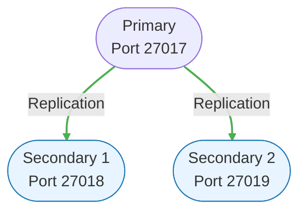

# Lab 05 – Replication and High Availability

## Objectives

By the end of this lab you should be able to:

- Set up and configure a MongoDB **replica set**
- Understand **primary/secondary** architecture
- Configure **read preferences** and **write concerns**
- Simulate **failover** scenarios and observe automatic recovery
- Monitor replication lag and **oplog**
- Implement strategies for **high availability**

This lab provides hands-on experience with database replication, a critical component of production NoSQL deployments.

---

## 1. Introduction to Replication

### 1.1. Why Replication?

Replication serves multiple purposes:

1. **High Availability**: If the primary fails, a secondary takes over
2. **Data Redundancy**: Multiple copies protect against data loss
3. **Read Scaling**: Distribute read operations across secondaries
4. **Disaster Recovery**: Geographically distributed replicas
5. **Maintenance**: Perform maintenance without downtime

### 1.2. MongoDB Replica Set Architecture



### 1.3. Key Concepts

- **Primary**: Receives all write operations
- **Secondary**: Replicates data from primary, can serve reads
- **Arbiter**: Participates in elections but doesn't hold data
- **Oplog**: Operations log that tracks all changes
- **Election**: Process of selecting a new primary
- **Read Preference**: Where to route read operations
- **Write Concern**: Level of acknowledgment for writes

---

## 2. Prerequisites

### 2.1. Software Requirements

- MongoDB 6.0+ installed
- Node.js 16+ installed
- At least 3GB free disk space
- Basic understanding of MongoDB from previous labs

### 2.2. Port Requirements

This lab uses the following ports (ensure they're available):

- 27017 (Primary)
- 27018 (Secondary 1)
- 27019 (Secondary 2)

---

## 3. Setup Instructions

### 3.1. Quick Setup

```bash
# For Unix/Linux/Mac:
./setup_replica_set.sh

# For Windows:
setup_replica_set.bat

# Or using Node.js:
node setup_replica_set.js
```

### 3.2. What the Setup Does

1. Creates data directories for 3 MongoDB instances
2. Starts 3 mongod processes on different ports
3. Configures them as a replica set
4. Loads sample data for testing
5. Verifies the replica set is working

---

## 4. Tasks

**Important:** Before running any JavaScript files, please refer to [FILE_USAGE_GUIDE.md](FILE_USAGE_GUIDE.md) to understand which files should be run with Node.js vs MongoDB Shell (mongosh).

### Task 1: Basic Replica Set Operations

#### 1.1. Check Replica Set Status

Connect to the primary and check the status:

```javascript
// Connect to primary
mongosh --port 27017

// Check replica set status
rs.status()

// Check replication configuration
rs.conf()

// Check who is primary
rs.isMaster()
```

#### 1.2. Insert Data and Verify Replication

Insert data on the primary and verify it appears on secondaries:

```javascript
// On primary (port 27017)
use lab05_replication
db.test_collection.insertOne({
  name: "Test Document",
  timestamp: new Date()
})

// Connect to secondary (port 27018)
mongosh --port 27018
use lab05_replication
rs.secondaryOk() // Allow reads on secondary
db.test_collection.find()
```

### Task 2: Read Preferences

#### 2.1. Implement Different Read Preferences

Test different read preference modes:

```javascript
// Run the read preference examples
node read_preferences.js
```

Understand these modes:

- `primary`: All reads from primary (default)
- `primaryPreferred`: Primary if available, else secondary
- `secondary`: All reads from secondaries
- `secondaryPreferred`: Secondary if available, else primary
- `nearest`: Lowest network latency

#### 2.2. Measure Read Performance

Compare read performance with different preferences:

```javascript
node benchmark_reads.js
```

### Task 3: Write Concerns

#### 3.1. Test Different Write Concerns

Experiment with write concern levels:

```javascript
// Run write concern examples
node write_concerns.js
```

Understand these options:

- `w: 1`: Acknowledged by primary only
- `w: "majority"`: Acknowledged by majority of replica set
- `w: 3`: Acknowledged by specific number of members
- `j: true`: Written to journal
- `wtimeout: 5000`: Timeout in milliseconds

#### 3.2. Measure Write Performance vs. Durability

```javascript
node benchmark_writes.js
```

### Task 4: Failover Simulation

#### 4.1. Simulate Primary Failure

```javascript
// Run the failover simulation
node simulate_failover.js
```

This script will:

1. Kill the primary process
2. Watch the election process
3. Verify a new primary is elected
4. Show the application continues working

#### 4.2. Manual Failover

Force a stepdown of the primary:

```javascript
// Connect to current primary
mongosh --port 27017

// Force primary to step down
rs.stepDown()

// Watch the election
rs.status()
```

### Task 5: Monitoring and Maintenance

#### 5.1. Monitor Replication Lag

```bash
# Run replication lag monitor
node monitor_replication.js --minutes=2 --interval=5
```

This command writes `monitor_report.json` with lag-per-member samples and election statistics. Keep the monitor running while you perform writes or failover drills to capture meaningful data.

#### 5.2. View the Oplog

```javascript
// Connect to any replica set member
use local
db.oplog.rs.find().sort({$natural: -1}).limit(10)

// Check oplog size and duration
rs.printReplicationInfo()
```

#### 5.3. Add a New Member

```javascript
// Add a fourth member to the replica set
node add_member.js --port 27020
```

### Task 6: Advanced Scenarios

#### 6.1. Configure a Delayed Secondary

Create a secondary with a 5-minute delay (useful for recovery from mistakes):

```javascript
node configure_delayed_secondary.js
```

#### 6.2. Configure Priority for Election

Set election priorities to control which member becomes primary:

```javascript
node configure_priorities.js
```

#### 6.3. Test Network Partitions

Simulate network partition (split-brain scenario):

```javascript
node simulate_network_partition.js
```

---

## 5. Exercises

### Exercise 1: Design for High Availability

Design a replica set configuration for an e-commerce application with:

- Geo-distributed members
- Read-heavy workload
- 99.99% uptime requirement

Document your design in `solution/ha_design.md`.

### Exercise 2: Implement Application Resilience

Modify the provided application to:

1. Handle primary failures gracefully
2. Retry failed writes
3. Route reads based on consistency requirements

Complete the code in `solution/resilient_app.js`.

### Exercise 3: Backup Strategy

Implement a backup strategy using:

1. Secondary member for backups
2. Point-in-time recovery using oplog
3. Consistent snapshots

Document your approach in `solution/backup_strategy.md`.

---

## 6. What to Submit

Your submission should include:

1. **`solution/replication_tests.js`** - Your test results from Tasks 1-5
2. **`solution/ha_design.md`** - Your high availability design (Exercise 1)
3. **`solution/resilient_app.js`** - Your resilient application (Exercise 2)
4. **`solution/backup_strategy.md`** - Your backup strategy (Exercise 3)
5. **`NOTES.md`** - Your observations and learnings

---

## 7. Self-Assessment Checklist

Use this list to confirm you exercised the main scenarios:

- **Replica Set Configuration** – You can rebuild the environment from scratch and explain each member’s role.
- **Read/Write Operations** – Demonstrate read preference changes and write concerns with recorded observations.
- **Failover Handling** – Perform a manual `rs.stepDown()` and document how your app reacts.
- **Monitoring & Maintenance** – Capture replication lag output via `monitor_replication.js`, inspect oplog window, and note any alerts/watchdogs you configured.
- **Documentation** – Summarize procedures and results in `NOTES.md` or companion files.

If you can repeat these steps without referencing the instructions, you've internalized the practice goals.

---

## 8. Troubleshooting

### Common Issues

1. **Replica set won't initialize**
   - Check all mongod processes are running
   - Verify network connectivity between instances
   - Check data directory permissions

2. **Can't read from secondary**
   - Run `rs.secondaryOk()` on the secondary
   - Check read preference settings

3. **Elections taking too long**
   - Check network latency
   - Verify election timeout settings
   - Ensure majority of members are available

4. **Replication lag is high**
   - Check secondary hardware resources
   - Review write load on primary
   - Check network bandwidth

### Useful Commands

```javascript
// Check replica set health
rs.status();

// Check replication lag
rs.printSlaveReplicationInfo();

// Force reconfiguration
rs.reconfig(cfg, { force: true });

// Check connections
db.adminCommand({ connPoolStats: 1 });
```

---

## 9. Additional Resources

- [MongoDB Replication Documentation](https://docs.mongodb.com/manual/replication/)
- [Replica Set Elections](https://docs.mongodb.com/manual/core/replica-set-elections/)
- [Read Preference](https://docs.mongodb.com/manual/core/read-preference/)
- [Write Concern](https://docs.mongodb.com/manual/reference/write-concern/)
- [Oplog Size](https://docs.mongodb.com/manual/core/replica-set-oplog/)

---

## 10. Optional Extensions

If you finish early, try these advanced topics:

1. **Set up a 5-member replica set** with 2 data centers
2. **Implement custom write concern** for critical operations
3. **Create a monitoring dashboard** for replica set health
4. **Test with chaos engineering** (random failures)
5. **Implement automated backup** using secondary members

---

### Basic Warm-up (Optional)

Before attempting the full replica set scenarios, consider running through the onboarding checklist in [`BASIC_EXERCISES.md`](BASIC_EXERCISES.md). It walks you through setup verification, primary/secondary reads, manual failover, and an introductory read-preference test.

---

### Advanced Challenges (Bonus Track)

Comprehensive, scenario-driven drills are documented in [`ADVANCED_EXERCISES.md`](ADVANCED_EXERCISES.md). They include:

1. Election chaos simulations with flaky networks and custom priorities.
2. Read-preference load testing to verify routing and latency.
3. Oplog watchdog scripts that raise alerts when lag exceeds a threshold.

Summaries and runbooks belong in the “Advanced Replication Runbook” section of `NOTES.md`.

---

Good luck! Remember, replication is crucial for production deployments, so take time to understand these concepts thoroughly.

---

### Feedback & Collaboration

- Open [GitHub Issues](https://github.com/diogoribeiro7/nosql-databases-labs/issues) with the `lab05` label for any replication script problems or feature requests.
- Discuss failover drills, read preferences, or monitoring strategies in [Discussions](https://github.com/diogoribeiro7/nosql-databases-labs/discussions) to learn from others.

---

## Advanced Monitoring Exercises

1. **Replica Set Dashboard** – Run `node monitor_replication.js --minutes=5 --interval=3` while issuing writes and plot lag per secondary from `monitor_report.json`.
2. **Oplog Health Alerts** – Extend the script to capture `collStats` on `local.oplog.rs` and alert when the oplog window falls below your safety threshold.
3. **Election Detection** – Combine `simulate_failover.js` with the monitor to compute mean time to recovery and validate automatic failover behavior.

Document these findings in the “Advanced Replication Runbook” section of `NOTES.md`.
