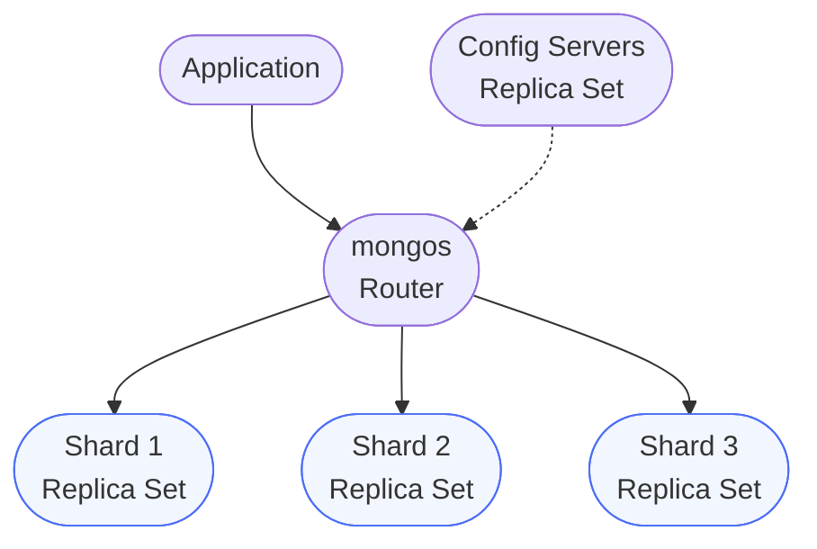

---
- Completion of Labs 1-5
- MongoDB 4.4+ installed
- Understanding of distributed systems concepts
- Multiple machine instances or Docker containers (for cluster setup)
---

# Lab Extra 02 – Sharding & Horizontal Scaling

## Objectives

By the end of this lab you should be able to:

- Understand MongoDB sharding concepts
- Choose appropriate shard keys
- Set up and configure a sharded cluster
- Monitor shard distribution and balancing
- Implement zone sharding for geo-distributed data
- Handle chunk migration and balancing

## 1\. Sharding Concepts

### 1.1 What is Sharding?

Sharding is MongoDB's approach to horizontal scaling:

- **Distributes data** across multiple machines
- **Increases capacity** as data grows
- **Improves performance** through parallelization
- **Provides high availability** with redundancy

### 1.2 Sharding Components



--------------------------------------------------------------------------------

## 2\. Setting Up a Sharded Cluster

### 2.1 Local Development Setup (Single Machine)

```bash
# Note: This shows the server setup. In production, these would be separate machines
# mongod = MongoDB server process
# mongos = MongoDB shard router process
# mongosh = MongoDB Shell (what you use to connect)

# After servers are running, connect with mongosh to configure:

# Connect to config server with mongosh
mongosh --port 27019

# In mongosh, initialize config replica set
rs.initiate({
  _id: "configRS",
  members: [{ _id: 0, host: "localhost:27019" }]
})
exit

# Connect to first shard with mongosh
mongosh --port 27020

# In mongosh, initialize shard replica set
rs.initiate({
  _id: "shard1RS",
  members: [{ _id: 0, host: "localhost:27020" }]
})
exit

# Repeat for other shards...

# Connect to mongos router with mongosh
mongosh --port 27017

# In mongosh, add shards to the cluster
sh.addShard("shard1RS/localhost:27020")
sh.addShard("shard2RS/localhost:27021")
sh.addShard("shard3RS/localhost:27022")
```

### 2.2 Docker Compose Setup

```yaml
# docker-compose.yml
version: '3.8'

services:
  # Config servers
  config1:
    image: mongo:5.0
    command: mongod --configsvr --replSet configRS --port 27019
    volumes:
      - config1_data:/data/db
    networks:
      - sharded

  # Shard 1
  shard1:
    image: mongo:5.0
    command: mongod --shardsvr --replSet shard1RS --port 27018
    volumes:
      - shard1_data:/data/db
    networks:
      - sharded

  # Shard 2
  shard2:
    image: mongo:5.0
    command: mongod --shardsvr --replSet shard2RS --port 27018
    volumes:
      - shard2_data:/data/db
    networks:
      - sharded

  # Router
  mongos:
    image: mongo:5.0
    command: mongos --configdb configRS/config1:27019 --port 27017
    ports:
      - "27017:27017"
    depends_on:
      - config1
      - shard1
      - shard2
    networks:
      - sharded

volumes:
  config1_data:
  shard1_data:
  shard2_data:

networks:
  sharded:
    driver: bridge
```

--------------------------------------------------------------------------------

## 3\. Choosing Shard Keys

### 3.1 Shard Key Considerations

Good shard keys have:

- **High cardinality** - Many unique values
- **Even distribution** - Balanced data across shards
- **Targeted queries** - Support common query patterns
- **Write distribution** - Avoid hotspots

### 3.2 Shard Key Patterns

```javascript
// Range-based sharding (ordered)
sh.shardCollection("mydb.users", { userId: 1 })

// Hashed sharding (random distribution)
sh.shardCollection("mydb.events", { _id: "hashed" })

// Compound shard key
sh.shardCollection("mydb.orders", { customerId: 1, orderDate: 1 })

// Geographic sharding
sh.shardCollection("mydb.locations", { region: 1, city: 1 })
```

### 3.3 Anti-patterns to Avoid

```javascript
// BAD: Monotonically increasing values (creates hotspot)
sh.shardCollection("mydb.logs", { timestamp: 1 })

// BAD: Low cardinality (poor distribution)
sh.shardCollection("mydb.products", { category: 1 }) // Only 10 categories

// BAD: Frequently updated fields
sh.shardCollection("mydb.users", { lastLogin: 1 })
```

--------------------------------------------------------------------------------

## 4\. Implementing Sharding

### 4.1 Enable Sharding on Database

```javascript
// Connect to mongos
use admin
sh.enableSharding("ecommerce")
```

### 4.2 Shard Collections

```javascript
// User collection - hashed sharding for even distribution
sh.shardCollection("ecommerce.users", { _id: "hashed" })

// Orders collection - compound key for query isolation
sh.shardCollection("ecommerce.orders", { customerId: 1, orderDate: 1 })

// Products collection - range sharding by category
sh.shardCollection("ecommerce.products", { category: 1, productId: 1 })

// Analytics collection - time-based sharding
sh.shardCollection("ecommerce.analytics", { timestamp: 1, userId: 1 })
```

--------------------------------------------------------------------------------

## 5\. Zone Sharding

### 5.1 Configure Geographic Zones

```javascript
// Define zones for geographic distribution
sh.addShardToZone("shard1RS", "NA")  // North America
sh.addShardToZone("shard2RS", "EU")  // Europe
sh.addShardToZone("shard3RS", "APAC") // Asia-Pacific

// Define zone ranges
sh.updateZoneKeyRange(
  "ecommerce.users",
  { region: "NA", userId: MinKey },
  { region: "NA", userId: MaxKey },
  "NA"
)

sh.updateZoneKeyRange(
  "ecommerce.users",
  { region: "EU", userId: MinKey },
  { region: "EU", userId: MaxKey },
  "EU"
)

sh.updateZoneKeyRange(
  "ecommerce.users",
  { region: "APAC", userId: MinKey },
  { region: "APAC", userId: MaxKey },
  "APAC"
)
```

--------------------------------------------------------------------------------

## 6\. Monitoring & Management

### 6.1 Check Sharding Status

```javascript
// Overall cluster status
sh.status()

// Detailed shard distribution
db.collection.getShardDistribution()

// Check chunk distribution
use config
db.chunks.aggregate([
  { $group: { _id: "$shard", count: { $sum: 1 } } },
  { $sort: { count: -1 } }
])
```

### 6.2 Balancer Management

```javascript
// Check balancer status
sh.getBalancerState()

// Stop balancer (for maintenance)
sh.stopBalancer()

// Start balancer
sh.startBalancer()

// Set balancer window
use config
db.settings.update(
  { _id: "balancer" },
  {
    $set: {
      activeWindow: {
        start: "23:00",
        stop: "06:00"
      }
    }
  },
  { upsert: true }
)
```

### 6.3 Monitor Performance

```javascript
// Check operation distribution
db.currentOp({ "shard": { $exists: true } })

// Analyze slow queries across shards
db.system.profile.find({ millis: { $gt: 100 } }).sort({ ts: -1 })

// Check connection pool stats
db.runCommand({ connPoolStats: 1 })
```

--------------------------------------------------------------------------------

## 7\. Advanced Sharding Patterns

### 7.1 Tag-Aware Sharding

```javascript
// Implement data locality for compliance
sh.addShardToZone("shard1RS", "GDPR")
sh.addShardToZone("shard2RS", "CCPA")

sh.updateZoneKeyRange(
  "ecommerce.users",
  { country: "DE", userId: MinKey },
  { country: "FR", userId: MaxKey },
  "GDPR"
)
```

### 7.2 Tiered Storage Strategy

```javascript
// Hot data on SSD shards, cold on HDD
sh.addShardToZone("ssdShard", "hot")
sh.addShardToZone("hddShard", "cold")

// Recent data to hot zone
const thirtyDaysAgo = new Date();
thirtyDaysAgo.setDate(thirtyDaysAgo.getDate() - 30);

sh.updateZoneKeyRange(
  "ecommerce.logs",
  { timestamp: thirtyDaysAgo, _id: MinKey },
  { timestamp: MaxKey, _id: MaxKey },
  "hot"
)
```

--------------------------------------------------------------------------------

## 8\. Exercises

### Exercise 1: Design Shard Key

Design optimal shard keys for:

1. Social media posts (billions of documents)
2. IoT sensor data (high write throughput)
3. E-commerce inventory (frequent updates)

### Exercise 2: Implement Multi-Tenant Sharding

```javascript
// TODO: Implement sharding strategy for multi-tenant SaaS
// Requirements:
// - Tenant data isolation
// - Balanced distribution
// - Efficient per-tenant queries
```

### Exercise 3: Migration Strategy

Create a migration plan to shard an existing 10TB collection:

1. Choose shard key
2. Plan downtime window
3. Implement pre-splitting
4. Monitor migration

### Exercise 4: Disaster Recovery

Implement shard failure recovery:

1. Detect shard failure
2. Promote replica to primary
3. Rebalance chunks
4. Verify data integrity

--------------------------------------------------------------------------------

## 9\. Performance Optimization

### 9.1 Pre-splitting Chunks

```javascript
// Pre-split for known distribution
for (let i = 0; i < 100; i++) {
  db.adminCommand({
    split: "ecommerce.users",
    middle: { userId: i * 10000 }
  });
}

// Move chunks manually for initial balance
sh.moveChunk(
  "ecommerce.users",
  { userId: 0 },
  "shard2RS"
)
```

### 9.2 Query Optimization

```javascript
// Targeted query (uses shard key)
db.orders.find({ customerId: "CUST123", orderDate: { $gte: ISODate("2024-01-01") } })

// Scatter-gather query (hits all shards) - AVOID
db.orders.find({ totalAmount: { $gt: 1000 } })

// Use explain to verify targeting
db.orders.find({ customerId: "CUST123" }).explain("executionStats")
```

--------------------------------------------------------------------------------

## 10\. Best Practices

1. **Choose shard key carefully** - Cannot be changed without re-sharding
2. **Monitor chunk distribution** - Ensure even balance
3. **Use targeted queries** - Include shard key in queries
4. **Plan for growth** - Pre-split for expected distribution
5. **Test failover scenarios** - Ensure high availability
6. **Document shard key decisions** - Future reference

--------------------------------------------------------------------------------

## Testing

Run the test suite:

```bash
npm test
```

Individual tests:

- `test_sharding.js` - Sharding setup tests
- `test_distribution.js` - Data distribution tests
- `test_performance.js` - Query performance tests

--------------------------------------------------------------------------------

## Additional Resources

- [MongoDB Sharding Documentation](https://docs.mongodb.com/manual/sharding/)
- [Shard Key Selection](https://docs.mongodb.com/manual/core/sharding-shard-key/)
- [Zone Sharding](https://docs.mongodb.com/manual/core/zone-sharding/)
- [Sharding Best Practices](https://docs.mongodb.com/manual/core/sharding-data-partitioning/)

---

## Feedback & Collaboration

- Use [GitHub Issues](https://github.com/diogoribeiro7/nosql-databases-labs/issues) with the `lab_extra_02` label to report sharding-lab bugs or request new scenarios.
- Swap cluster setup tips or performance findings in [Discussions](https://github.com/diogoribeiro7/nosql-databases-labs/discussions) to help others troubleshoot.
